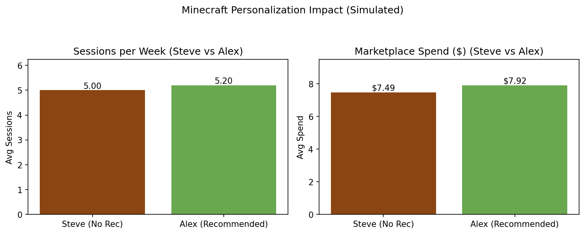

# Minecraft Personalization Work Sample: A/B Test with CUPED  
Author: Crystal M. Ford  

## Overview  
This project simulates a personalization experiment in Minecraft to evaluate the impact of recommending marketplace content (skins, packs, items) on player engagement and spending.  

The dataset is simulated, but the process mirrors how a game studio might approach personalization:  
- Define clear hypotheses about recommended content  
- Randomize players into control and treatment groups  
- Apply variance reduction (CUPED) to sharpen results  
- Translate findings into player experience and business outcomes  

The goal: demonstrate how I design, analyze, and explain personalization experiments to support data-driven decisions.  

## Study Design  
**Experiment:** 2 groups — Steve (Control, no recommendation) vs. Alex (Treatment, recommended content)  
**Metrics:**  
- Engagement = Sessions per week  
- Monetization = Marketplace spend (USD per player per month)  
**Hypotheses:**  
- Recommendations increase sessions per week  
- Recommendations increase marketplace spend  
**Randomization:** Probabilistic assignment biased toward realistic segments (e.g., Builders, Teens, Marketplace players)  
**Variance Reduction:** CUPED applied using pre-experiment engagement and spend baselines  

## Results  
Here’s the core result (average values for each group):  

  

**Sessions per week:**  
- Steve (No Rec): 5.00  
- Alex (Recommended): 5.20  
- Lift: +0.20 sessions (+4%)  

**Marketplace spend:**  
- Steve (No Rec): $7.49  
- Alex (Recommended): $7.92  
- Lift: +$0.43 per player (+6%)  

CUPED reduced variance, improving confidence in results without changing the estimated lift.  

## Executive Summary  
- **Finding:** Recommendations increased both play sessions and marketplace spend  
- **Impact:** Even small per-player lifts scale to significant revenue and engagement at Minecraft’s global player base  
- **Recommendation:** Continue experimentation with personalization strategies; prioritize features that improve both player satisfaction and monetization  
